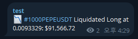

# binance-liquidation
Binance Futures All Market Liquidation Order Alert for Telegram Channel.  

## Features
- Fetches all Binance Futures liquidation orders.
- Sends alerts to Telegram when liquidation value exceeds `THRESHOLD`.
- `🔥` Emojis are added for liquidation values exceeding 100k, 1M and 10M.  

## Environment Variables
- This project retrieves environment variables from the `config/.env` file.
- The `.env` file must be located in the `config/` folder within the project root.
- Use the existing `config/.env.example` file to create your `config/.env` file.  

## Caution
- Setting `THRESHOLD` too low can hit Telegram's rate limit.  

## Sample
- Tested in Oracle Cloud Instance over 6 months with no problems.

